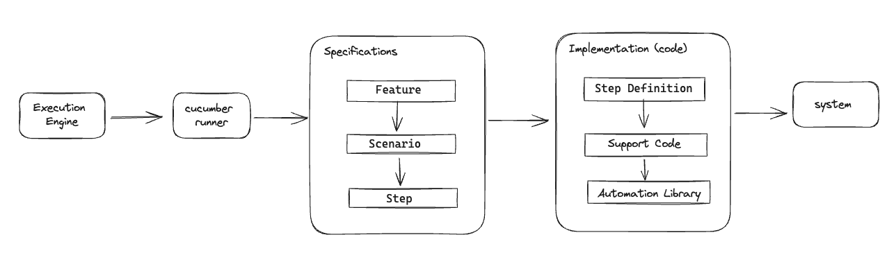

<h1 style="text-align: center;"> What is BDD?</h1>

Behavior-Driven Development (BDD) is a software development methodology popularized by Dan North in the mid-2000s as an extension of Test-Driven Development (TDD) with a focus on collaboration and communication between developers, testers, and business stakeholders.

Key Points:
 - **Focus on Behavior:** BDD emphasizes the behaviors and outcomes of the software from the end user's perspective.
 - **Common Language:** Uses a common language to describe behaviors, typically structured in Given-When-Then scenarios.
 - **Collaboration:** Encourages collaboration between technical and non-technical team members to ensure the software meets business requirements.

BDD Workflow:
1. Discovery
> Collaboratively discover and define user stories and scenarios with all stakeholders.
2. Formulation
Translate user stories into concrete, executable scenarios using the Given-When-Then format.
3. Automation
> Implement automated tests for the scenarios using a BDD framework (e.g., Behave for Python).
4. Execution
> Run automated tests to verify the application behaves as expected.
5. Review
> Regularly review and update scenarios to ensure they reflect the current state of the application.

<h1 style="text-align: center;"> Gherkin</h1>

Gherkin is a domain-specific language used for writing human-readable descriptions of software behaviors without detailing how that functionality is implemented. It is a pivotal part of Behavior-Driven Development (BDD), providing a way to describe software's expected behaviors in a clear and understandable manner for all stakeholders, including non-technical team members.

Key Characteristics:
1. Structured Syntax:
   *Gherkin follows a specific syntax that uses keywords such as Feature, Scenario, Given, When, Then, And, and But to structure the descriptions.*
2. Executable Documentation:
   *Gherkin scenarios are written in plain text and can be executed as tests by BDD tools like Cucumber or Behave, serving both as documentation and automated tests.*
3. Readability:
   *The language is designed to be easy to read and understand, ensuring that everyone involved in the development process can comprehend the scenarios.*
4. Feature Files:
   *Gherkin scenarios are organized into feature files, typically with a .feature extension, which describe a particular feature of the application.*

Keywords in Gherkin:
 - **Feature:** Describes the feature being tested.
 - **Scenario:** Defines a specific situation or test case.
 - **Given:** Sets up the initial context or state.
 - **When:** Describes an action or event.
 - **Then:** Specifies the expected outcome.
 - **And:** Used to add additional steps in Given, When, or Then.

<h1 style="text-align: center;"> Cucumber </h1>
<a href="https://cucumber.io/docs/bdd/">Cucumber</a> is a popular tool used for Behavior-Driven Development. It supports multiple programming languages for writing its step definitions, including: Java, JavaScript (Node.js), Ruby, Python,.NET (C#)

**Basic steps to set up Cucumber for your project:**
### 1. Install Dependencies:

Ensure you have a compatible programming language installed (e.g., Java, Ruby, JavaScript).
Install Cucumber itself, which typically involves adding it as a dependency in your project's build configuration file (e.g., `pom.xml` for Maven in Java projects, Gemfile for Ruby projects, package.json for JavaScript projects).


```
<dependency>
    <groupId>io.cucumber</groupId>
    <artifactId>cucumber-java</artifactId>
    <version>7.18.0</version>
    <scope>test</scope>
</dependency>
```
### 2. Create a Project Structure:

Set up a directory structure for your Cucumber tests. Typically, you'll have feature files (with .feature extension) in a features directory, and step definitions (associated code) in a step_definitions directory.
### 3. Write Feature Files:

Create .feature files using Gherkin syntax to describe the behavior of your application in a human-readable format. Define scenarios and steps that reflect user interactions and expected outcomes.
```
Feature: Login Functionality

  Scenario Outline: Login with Different Sets of Credentials
    Given I am on the login page
    When I enter username "<username>" and password "<password>"
    And I click the login button
    Then I should <login_result>

    Examples:
      | username   | password      | login_result              |
      | user123    | Password123   | be redirected to the dashboard page and see a welcome message "Welcome, user123!" |
      | invaliduser | InvalidPassword | see an error message "Invalid username or password" and remain on the login page |
```
**Data-Driven Testing with Scenario Outline in Cucumber**

Data-Driven Testing is a technique in Cucumber that allows you to execute the same scenario multiple times with different sets of data. This helps in testing various inputs and expected outcomes efficiently without duplicating scenarios.

**Structure of a Scenario Outline:**
 - Scenario Outline: Defines a template for scenarios with placeholders for dynamic data.
   - Uses the `Scenario Outline` keyword instead of `Scenario`.
   - Placeholder values are enclosed in angle brackets (`<username>`, `<password>`).
 - Examples Keyword: Follows the Scenario Outline and provides a table of test data.
    - Each row in the `Examples` table represents a unique set of input data and expected outcomes.
   - Data from the Examples table is substituted into the placeholders defined in the Scenario Outline.
### 4. Implement Step Definitions:

Write step definitions in your preferred programming language to map each Gherkin step (from the .feature files) to automation code. These step definitions execute the actions and assertions necessary to test the specified behavior.
```
import io.cucumber.java.en.Given;
import io.cucumber.java.en.When;
import io.cucumber.java.en.Then;
import static org.junit.Assert.*;

public class LoginSteps {

    @Given("I am on the login page")
    public void i_am_on_the_login_page() {
        // Implement code to navigate to the login page
    }

    @When("I enter username {string} and password {string}")
    public void i_enter_username_and_password(String username, String password) {
        // Implement code to enter username and password
        // For demonstration, let's assume using WebDriver for UI interactions
        // WebDriver driver = new ChromeDriver();
        // driver.findElement(By.id("username")).sendKeys(username);
        // driver.findElement(By.id("password")).sendKeys(password);
    }
   ,,,
}
```
### 5. Run Your Tests:

Execute your Cucumber tests using the command-line interface provided by Cucumber for your chosen language. This command typically involves specifying the path to your feature files and step definitions.

#### **Step 1: Update `pom.xml`**

Ensure your pom.xml includes the necessary dependencies. Here's an example with additional dependencies for Cucumber and Selenium WebDriver (assuming you are testing a web application):
```
<project xmlns="http://maven.apache.org/POM/4.0.0" 
         xmlns:xsi="http://www.w3.org/2001/XMLSchema-instance"
         xsi:schemaLocation="http://maven.apache.org/POM/4.0.0 
                             http://maven.apache.org/xsd/maven-4.0.0.xsd">
    
    <modelVersion>4.0.0</modelVersion>
    <groupId>your.groupid</groupId>
    <artifactId>your-artifactid</artifactId>
    <version>1.0-SNAPSHOT</version>
    
    <dependencies>
        <!-- Cucumber dependencies -->
        <dependency>
            <groupId>io.cucumber</groupId>
            <artifactId>cucumber-java</artifactId>
            <version>7.18.0</version>
            <scope>test</scope>
        </dependency>
        <dependency>
            <groupId>io.cucumber</groupId>
            <artifactId>cucumber-core</artifactId>
            <version>7.18.0</version>
            <scope>test</scope>
        </dependency>
        <dependency>
            <groupId>io.cucumber</groupId>
            <artifactId>cucumber-junit</artifactId>
            <version>7.18.0</version>
            <scope>test</scope>
        </dependency>
        
        <!-- Optional: Selenium WebDriver dependencies for web application testing -->
        <!-- Uncomment if testing a web application -->
        <!--
        <dependency>
            <groupId>org.seleniumhq.selenium</groupId>
            <artifactId>selenium-java</artifactId>
            <version>3.141.59</version>
            <scope>test</scope>
        </dependency>
        -->
    </dependencies>

    <build>
        <plugins>
            <!-- Maven Surefire plugin to execute tests -->
            <plugin>
                <groupId>org.apache.maven.plugins</groupId>
                <artifactId>maven-surefire-plugin</artifactId>
                <version>3.0.0-M5</version>
                <configuration>
                    <includes>
                        <include>**/*.java</include>
                    </includes>
                    <testFailureIgnore>true</testFailureIgnore> <!-- Set to false to fail on test failures -->
                </configuration>
            </plugin>
        </plugins>
    </build>
</project>
```

#### **Step 2: Write Test Runner Class**

Create a test runner class (RunCucumberTest.java) in your test source folder (src/test/java) that specifies the path to your feature files and step definitions:
```
import io.cucumber.junit.Cucumber;
import io.cucumber.junit.CucumberOptions;
import org.junit.runner.RunWith;

@RunWith(Cucumber.class)
@CucumberOptions(
    features = "src/test/resources/features", // Path to your feature files
    glue = {"your.step.definitions.package"}, // Package name where your step definitions are located
    tags = "@Login", // Optional: Tags to specify which scenarios to run
    plugin = {"pretty", "html:target/cucumber-reports"} // Optional: Report formats
)
public class RunCucumberTest {
    // This class will run all feature files under src/test/resources/features
}

```
#### **Step 3: Run the Tests**

You can run the tests using Maven from the command line:
```
mvn test
```

This command will compile your project, execute the Cucumber tests specified in the RunCucumberTest class, and generate reports in the target/cucumber-reports directory (if configured).

*Notes:*
 - Replace `your.groupid`, `your-artifactid`, and `your.step.definitions.package` with your actual Maven project details and package names.
- Modify the `@CucumberOption`s annotations (`features`, `glue`, `tag`s, `plugin`) in RunCucumberTest.java as per your project structure and testing requirements.
- Ensure your feature files (`*.feature`) are placed under `src/test/resources/features` or update the path accordingly in the `@CucumberOptions` annotation.

This setup allows you to effectively run Cucumber tests with Java and Maven, integrating smoothly with your project’s build and test automation processes. Adjust dependencies and configurations based on your specific testing needs and application requirements.
### 6. Review and Refine:
>As you run your tests, review the results and refine both your feature files and step definitions as needed to accurately reflect and test your application's behavior.

----
### Test Execution Workflow



